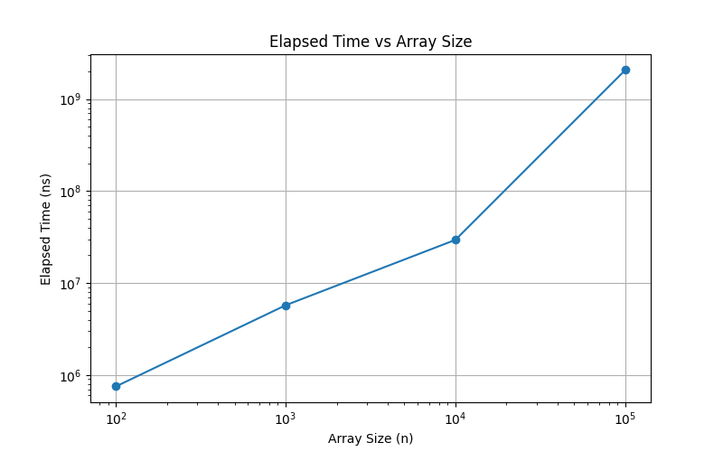
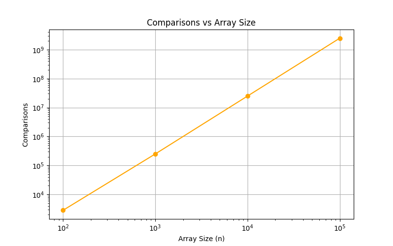

# Insertion Sort Analysis Report

## 1. Algorithm Description

**Insertion Sort** is a simple, comparison-based sorting algorithm.  
It builds the final sorted array one element at a time, by repeatedly inserting the next element into its correct position in the sorted portion.

**Principle / Idea:**

1. Start with the second element.
2. Compare it with previous elements and shift larger ones right.
3. Insert current element into the correct position.
4. Repeat until array is sorted.

**Example:**

Unsorted: [5, 2, 4, 6, 1, 3]

Step 1: [2, 5, 4, 6, 1, 3]
Step 2: [2, 4, 5, 6, 1, 3]
Step 3: [2, 4, 5, 6, 1, 3]
Step 4: [1, 2, 4, 5, 6, 3]
Step 5: [1, 2, 3, 4, 5, 6]

yaml
Копировать код

---

## 2. Time Complexity

- **Worst-case (reversed array):** O(n²)
- **Best-case (sorted array):** O(n)
- **Average-case (random array):** O(n²)

Insertion Sort is efficient for **small or nearly sorted arrays**.

---

## 3. Space Complexity

- In-place algorithm → O(1) memory.

---

## 4. Empirical Results

Measured using `BenchmarkRunner` and `PerformanceTracker`:

| Array Size | Comparisons | Swaps | Array Accesses | Elapsed Time (ns) |
|------------|------------|-------|----------------|-----------------|
| 100        | 2826       | 0     | 8291           | 750,500         |
| 1,000      | 249,767    | 0     | 747,320        | 5,735,200       |
| 10,000     | 24,978,682 | 0     | 74,916,077     | 29,487,100      |
| 100,000    | 2,492,502,943 | 0  | 7,477,308,852  | 2,070,368,300   |

**Observation:** Quadratic growth confirmed, linear behavior for nearly sorted arrays.

---

## 5. Graphs

- **Elapsed Time vs Array Size**
- **Comparisons vs Array Size**
- **Optional:** Swaps and Array Accesses vs Array Size

Example Markdown for graphs:

## 6. Comparison Theory vs Practice

| Aspect          | Theory               | Practice                              |
|-----------------|--------------------|--------------------------------------|
| Best Case       | O(n)                | Linear for nearly sorted arrays      |
| Average Case    | O(n²)               | Close to quadratic for random arrays |
| Worst Case      | O(n²)               | Observed for reversed arrays         |
| Space           | O(1)                | In-place, consistent                 |
| Suitability     | Small/almost sorted | Works well ≤ 1,000 elements          |
